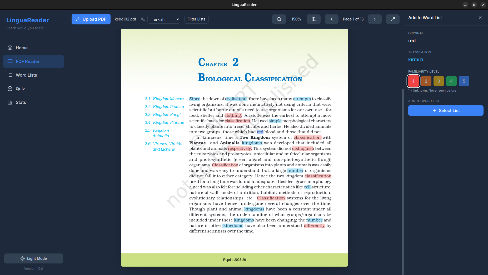
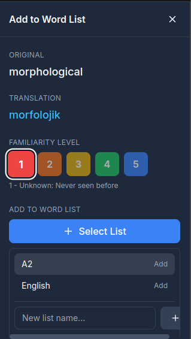
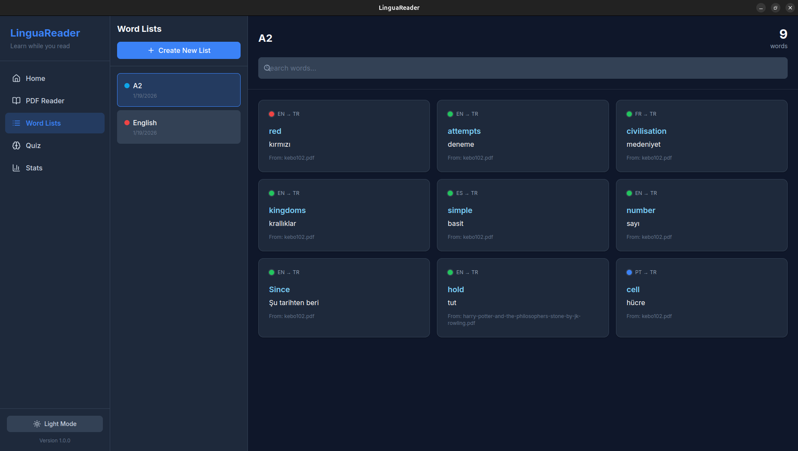
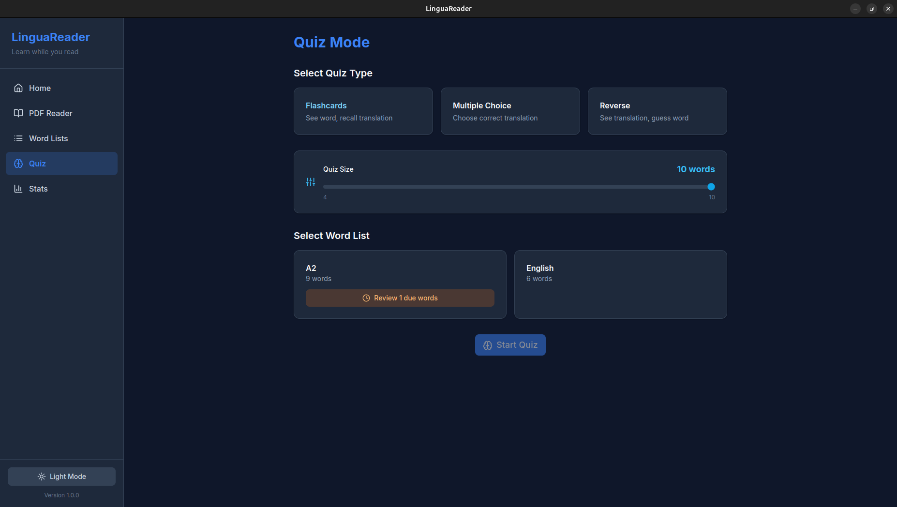

# 📚 LinguaReader


> **A powerful, modern PDF reader designed for language learners.**  
> *Read native content, translate instantly context-aware, and build your vocabulary seamlessly using Spaced Repetition.*

[](https://github.com/yusufdinc974/LinguaReader/releases)
[](https://github.com/yusufdinc974/LinguaReader/releases)
[](https://opensource.org/licenses/MIT)

---

## ✨ Features

### 📖 Smart PDF Reading
*   **Resume Anywhere**: Automatically remembers your last page for every book.
*   **Distraction Free**: Focus mode cleans up the interface for deep reading.
*   **Fast Rendering**: Powered by optimized PDF.js for smooth scrolling.

### 🌐 Instant Contextual Translation
*   **Click-to-Translate**: Simply click any word to get its meaning instantly.
*   **Sentence Context**: Translates whole sentences to help you grasp idioms and grammar.
*   **Powered by AI**: Uses advanced translation models for high accuracy.

### 🧠 Vocabulary Building (SRS)
*   **One-Click Add**: Save interesting words to your custom lists instantly.
*   **Spaced Repetition**: Built-in flashcard system (Anki-style) ensures you review words right before you forget them.
*   **Smart Quizzes**: Test yourself with multiple-choice questions derived from your actual reading context.

### 🎨 Modern & Customizable
*   **Theming**: Beautiful Dark and Light modes.
*   **Visualization**: Track your daily progress with interactive charts.
*   **Responsive**: Works great on any screen size.

---

## 📸 Screenshots

| Reading Mode | Translation & Vocab |
|:---:|:---:|
|  |  |

| Vocabulary Dashboard | Flashcard Quiz |
|:---:|:---:|
|  |  |

---

## 🚀 Installation

### 🐧 Linux (Debian/Ubuntu/Mint)
1.  **Download** the latest `.deb` file from the [Releases Page](https://github.com/yusufdinc974/LinguaReader/releases).
2.  **Install**:
    ```bash
    sudo dpkg -i linguareader_*.deb
    ```
3.  Launch **LinguaReader** from your applications menu.

*(Note: An `AppImage` is also available if you prefer portable apps).*

### 🪟 Windows
1.  **Download** the `.exe` installer from [Releases](https://github.com/yusufdinc974/LinguaReader/releases).
2.  Run the installer.
3.  *(If prompted by SmartScreen, click "More info" > "Run anyway" - this is normal for unsigned apps).*

### 🍎 macOS
1.  **Download** the `.dmg` file from [Releases](https://github.com/yusufdinc974/LinguaReader/releases).
2.  Open the `.dmg` and drag **LinguaReader** to your Applications folder.
3.  *(If blocked by Gatekeeper, right-click the app and select "Open", then confirm).*

---

## 🛠️ Development

Want to contribute? Check out our [Contributing Guidelines](CONTRIBUTING.md).

### Prerequisites
*   Node.js (v18 or later)
*   NPM

### Setup

```bash
# 1. Clone the repository
git clone https://github.com/yusufdinc974/LinguaReader.git
cd LinguaReader

# 2. Install dependencies
npm install

# 3. Run development server (Vite + Electron)
npm run dev
```

### Building

```bash
# Build for Linux
npm run build:linux

# Build for Windows
npm run build:win

# Build for macOS
npm run build:mac
```


## 🔄 Updates

LinguaReader keeps itself up to date automatically to ensure you always have the latest features and bug fixes.

### Windows & Linux
*   **Automatic**: The app checks for updates on startup.
*   **Seamless**: If an update is found, it downloads in the background. You'll see a notification when it's ready to install.
*   **Restart**: Simply restart the app to apply the update.

### macOS
*   **Manual**: Due to Apple's security policies, auto-updates are disabled.
*   **Notification**: You will be notified when a new version is available.
*   **Action**: Click the notification to open the [Releases Page](https://github.com/yusufdinc974/LinguaReader/releases) and download the latest `.dmg` file manually.

---

## 💾 Import / Export

You can easily backup your data or import new word lists from other sources.

### Backup & Restore
*   **Export Data**: Generates a full JSON backup of all your word lists, words, progress, and settings.
*   **Import Data**: Restores a previously exported backup file.

### Custom Word Lists (JSON)
You can create your own word lists externally and import them into LinguaReader. This is perfect for bulk importing vocabulary.

**Format:**
Create a `.json` file with the following structure:

```json
{
  "listName": "My Custom List",
  "listDescription": "Optional description for the list",
  "words": [
    {
      "word": "bonjour",
      "translation": "hello",
      "source_language": "fr",
      "target_language": "en"
    },
    {
      "word": "merci",
      "translation": "thank you"
    }
  ]
}
```

*   **Required Fields**: `word`, `translation`
*   **Optional Fields**: `listName`, `listDescription`, `source_language`, `target_language`

---


## 📄 License

Distributed under the MIT License. See `LICENSE` for more information.

---

<div align="center">
  <p>Made with ❤️ by <a href="https://github.com/yusufdinc974">Yusuf Dinc</a></p>
</div>
