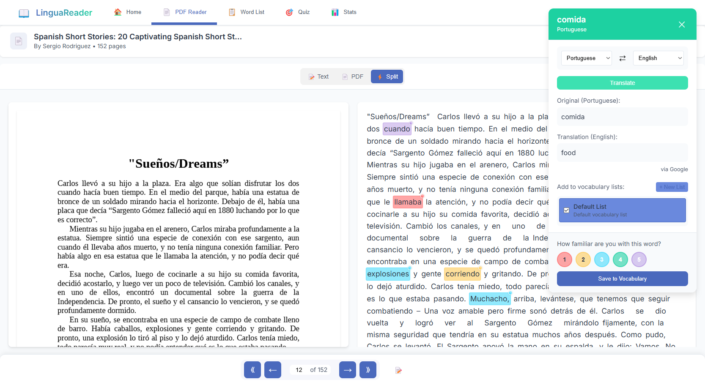
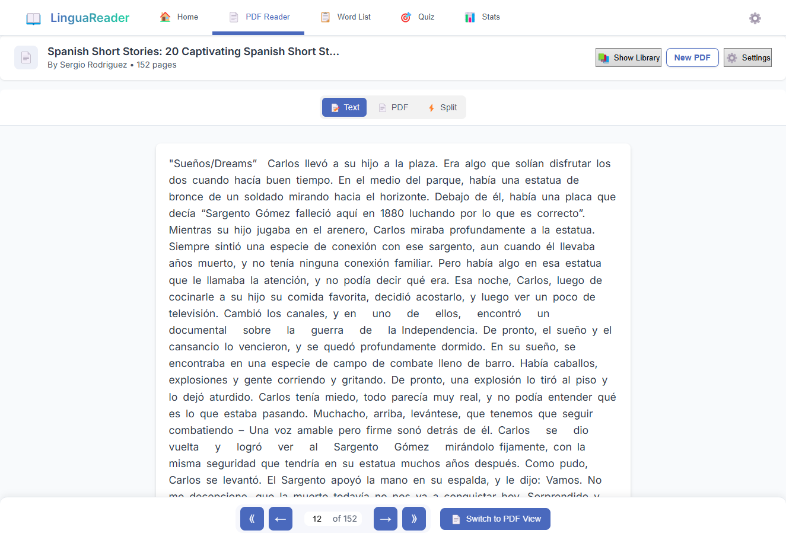
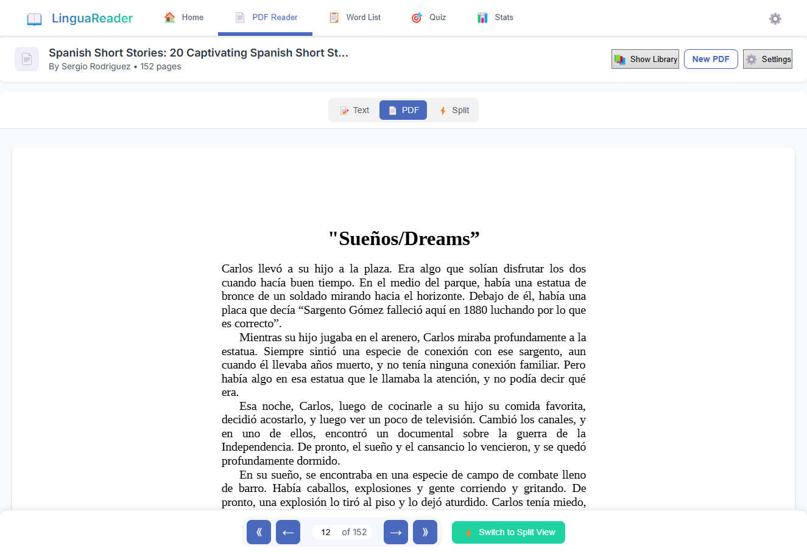
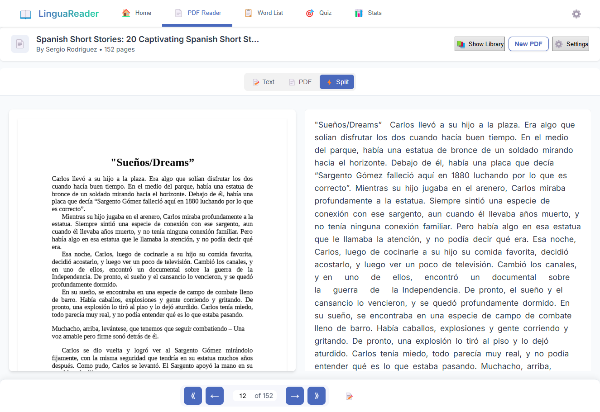
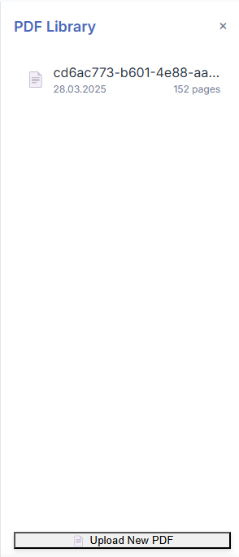
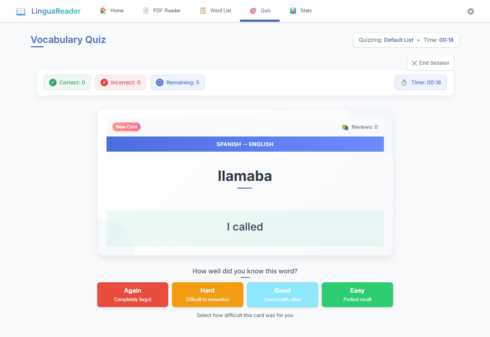
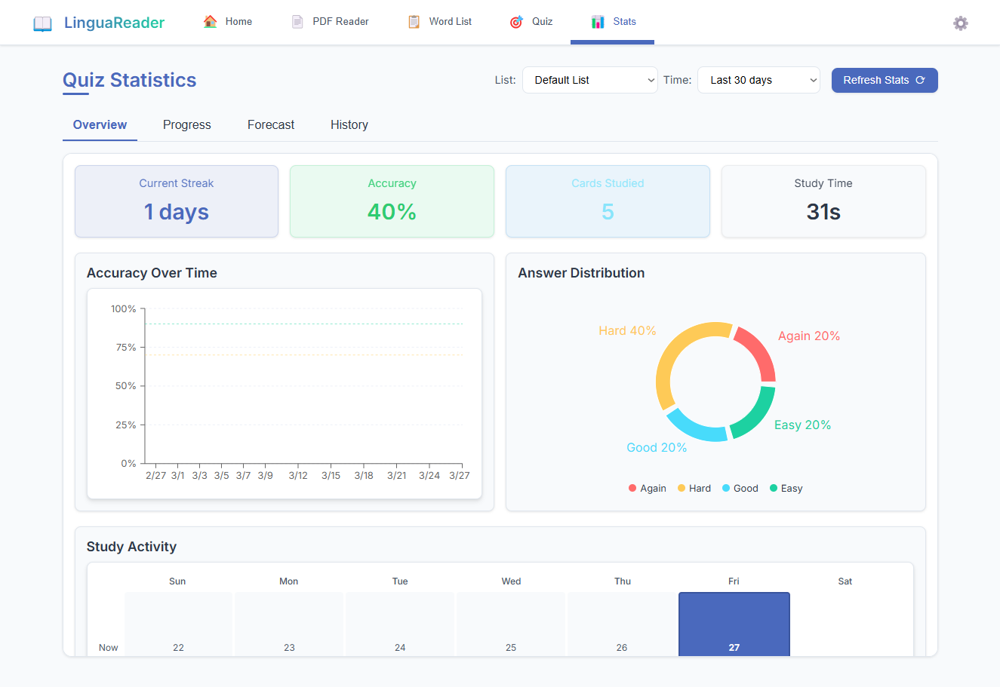
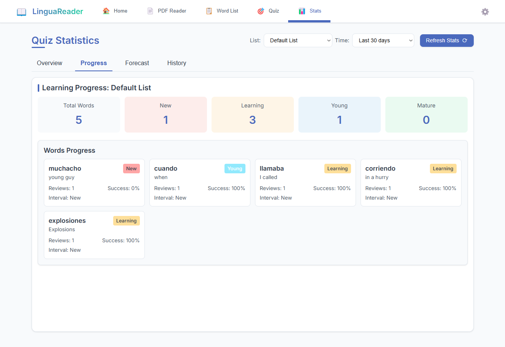
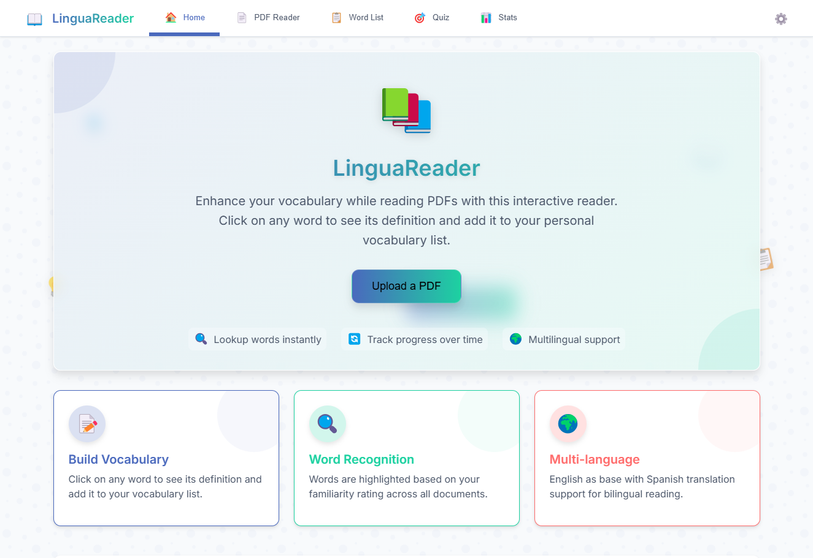
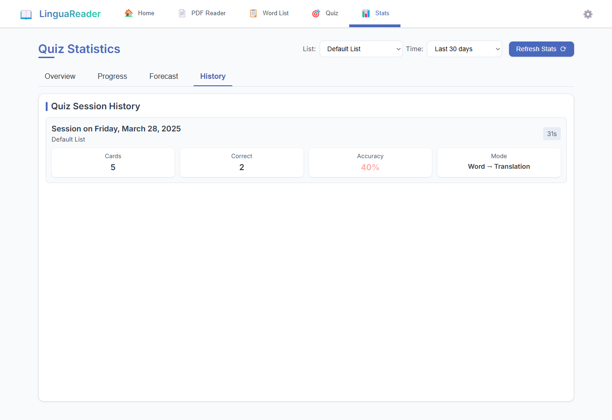

# 📚 LinguaReader

<div align="center">
  
  
  <h2>Transform your language learning journey through interactive reading</h2>
  
  [](https://github.com/yusufdinc974/LinguaReader/releases)
  [](LICENSE)
  [](https://www.electronjs.org/)
  [](https://reactjs.org/)
  
  <p align="center">
    <a href="#-key-features">Features</a> •
    <a href="#-installation">Installation</a> •
    <a href="#-getting-started">Getting Started</a> •
    <a href="#-vocabulary-mastery">Vocabulary</a> •
    <a href="#-quiz-system">Quiz</a> •
    <a href="#-development">Development</a>
  </p>
</div>

---

## ✨ LinguaReader: The Ultimate PDF Vocabulary Builder

LinguaReader is a revolutionary desktop application designed for language learners who want to **improve their vocabulary while reading authentic materials**. Instead of constantly switching between your reading and a dictionary, LinguaReader creates an integrated experience where definitions are just a click away.

> "Learning vocabulary in context is proven to be 2-3 times more effective than memorizing word lists." — *Linguistic Research Journal*

<div align="center">
  
</div>

---

## 🚀 Key Features

### 📖 Immersive Reading Experience

LinguaReader transforms how you interact with texts by offering **three powerful viewing modes**:

<div align="center">
  <table>
    <tr>
      <td align="center">
        <br />
        <strong>Text View</strong><br />
        Clean, formatted text with interactive vocabulary highlighting
      </td>
      <td align="center">
        <br />
        <strong>PDF View</strong><br />
        Original document layout and formatting
      </td>
      <td align="center">
        <br />
        <strong>Split View</strong><br />
        Side-by-side PDF and interactive text
      </td>
    </tr>
  </table>
</div>

- **Adaptive Text Parsing**: Intelligently extracts and formats text for maximum readability
- **Multi-page Navigation**: Smooth transitions between pages with keyboard shortcuts
- **Document Progress Tracking**: Never lose your place with automatic bookmark saving
- **Customizable Display**: Adjust text size, spacing, and contrast for comfortable reading

### 🔍 Interactive Vocabulary Building

Transform every reading session into a vocabulary expansion opportunity:


1. **One-Click Definitions**: Simply click on any unfamiliar word to instantly see its definition
2. **Personalized Familiarity System**: Rate words from 1-5 based on your knowledge level
   - Level 1: 🔴 Completely new words
   - Level 2: 🟠 Recognized but meaning unclear
   - Level 3: 🟡 Partially understood
   - Level 4: 🟢 Known but need reinforcement
   - Level 5: 🔵 Completely mastered
3. **Intelligent Word Highlighting**: Words are automatically highlighted according to your familiarity ratings across all documents
4. **Context Preservation**: Save not just the word but the sentence it appeared in for better recall
5. **Smart Word Detection**: Properly handles conjugations, plurals, and other word forms

### 📚 Comprehensive PDF Library Management

Keep your learning materials organized and accessible:

<div align="center">
  
</div>

- **Centralized Document Repository**: All your PDFs in one convenient location
- **Automatic Metadata Extraction**: Title, author, and page count automatically identified
- **Reading Progress Indicators**: Visual indicators of how much of each document you've read
- **Last-Read Position Memory**: Jump back to exactly where you left off in any document
- **Search Functionality**: Quickly find documents by title, author, or content
- **Document Tags**: Organize PDFs by language level, topic, or course

### 💡 Vocabulary Management System

Take control of your growing vocabulary with powerful organization tools:

<div align="center">
  
</div>

- **Custom Vocabulary Lists**: Create specialized lists for different topics, courses, or difficulty levels
- **Comprehensive Word Details**: View definitions, examples, pronunciation, and personal notes
- **Multi-language Support**: Perfect for learning multiple languages simultaneously
- **Filtered Views**: Sort and filter words by familiarity, date added, or alphabetically
- **Bulk Operations**: Mass update, export, or test yourself on selected words
- **Vocabulary Statistics**: Track growth, retention, and mastery rates over time

### 🎯 Adaptive Quiz System

Reinforce your learning with a quiz system based on proven memory techniques:

<div align="center">
  
</div>

- **Spaced Repetition Algorithm**: Based on scientific research for optimal retention
- **Multiple Quiz Formats**:
  - Definition Matching
  - Fill-in-the-blank with context
  - Multiple choice recognition
  - Spelling tests
- **Difficulty Adaptation**: Quizzes adjust to your performance for optimal challenge
- **Session Planning**: Choose length, difficulty, and focus for each study session
- **Immediate Feedback**: Learn from mistakes with detailed explanations
- **Progress Tracking**: See improvement over time with detailed analytics

### 📊 Comprehensive Learning Analytics

Gain insights into your learning progress with detailed statistics:

<div align="center">
  
</div>

<div align="center">
  
</div>

- **Vocabulary Growth Metrics**: Track new words learned over time
- **Retention Analysis**: See how well you're remembering words
- **Reading Volume Statistics**: Monitor your reading quantity and pace
- **Weakest Words Identification**: Focus on words you struggle with most
- **Learning Patterns**: Identify optimal study times and patterns
- **Export Capabilities**: Generate reports for sharing or personal reference

---

## 📥 Installation

### Windows
<details>
<summary><strong>Click to expand Windows installation instructions</strong></summary>

1. Download the latest installer from our [Releases Page](https://github.com/yusufdinc974/LinguaReader/releases)
2. Double-click the downloaded `.exe` file
3. Follow the installation wizard:
   
    <div align="center">
  <a href="https://github.com/yusufdinc974/LinguaReader/releases">
    
  </a>
</div>
   
4. Choose your installation location (or leave as default)
5. Select whether to create desktop and start menu shortcuts
6. Complete the installation and launch LinguaReader

**System Requirements:**
- Windows 10 or newer
- 4GB RAM minimum (8GB recommended)
- 500MB available disk space
- 1280x720 minimum screen resolution

</details>

### macOS
<details>
<summary><strong>Click to expand macOS installation instructions</strong></summary>

1. Download the latest `.dmg` file from our [Releases Page](https://github.com/yusufdinc974/LinguaReader/releases)
2. Open the downloaded file
3. Drag the LinguaReader icon to your Applications folder:
   
   <div align="center">
  <a href="https://github.com/yusufdinc974/LinguaReader/releases">
    
  </a>
</div>
   
4. If you encounter a security warning, go to System Preferences > Security & Privacy and click "Open Anyway"
5. Launch LinguaReader from your Applications folder or dock

**System Requirements:**
- macOS 10.13 (High Sierra) or newer
- 4GB RAM minimum (8GB recommended)
- 500MB available disk space
- 1280x720 minimum screen resolution

</details>

### Linux
<details>
<summary><strong>Click to expand Linux installation instructions</strong></summary>

Choose the appropriate method for your distribution:

#### AppImage (Universal)
```bash
# Download the AppImage
wget https://github.com/yusufdinc974/LinguaReader/releases/download/v0.1.0/LinguaReader-0.1.0.AppImage

# Make it executable
chmod +x LinguaReader-0.1.0.AppImage

# Run the application
./LinguaReader-0.1.0.AppImage
```

#### Debian/Ubuntu
```bash
# Download the .deb package
wget https://github.com/yusufdinc974/LinguaReader/releases/download/v0.1.0/linguareader_0.1.0_amd64.deb

# Install
sudo dpkg -i linguareader_0.1.0_amd64.deb
sudo apt-get install -f  # Install dependencies if needed
```

#### Fedora/RHEL
```bash
# Download the .rpm package
wget https://github.com/yusufdinc974/LinguaReader/releases/download/v0.1.0/linguareader-0.1.0.x86_64.rpm

# Install
sudo rpm -i linguareader-0.1.0.x86_64.rpm
```

**System Requirements:**
- Modern Linux distribution (Ubuntu 18.04+, Fedora 30+, etc.)
- 4GB RAM minimum (8GB recommended)
- 500MB available disk space
- 1280x720 minimum screen resolution

</details>

---

## 🚀 Getting Started

### First Launch Experience

<div align="center">
  
</div>

When you first launch LinguaReader, you'll be greeted with a welcome screen:

1. Click "Upload PDF" to select your first document
2. Browse to the PDF file on your computer and open it
3. LinguaReader will process the document and display it in vocabulary mode
4. You're ready to start building your vocabulary!

### Reading and Building Vocabulary

<div align="center">
  <table>
    <tr>
        <h4>Quick Start Guide:</h4>
        <ol>
          <li>Use the navigation controls at the bottom to move through pages</li>
          <li>Click on any unfamiliar word to see its definition</li>
          <li>Rate your familiarity with the word (1-5)</li>
          <li>Words will be automatically saved to your vocabulary</li>
          <li>Try different view modes using the switches at the top</li>
        </ol>
      </td>
    </tr>
  </table>
</div>

---

## 📘 Vocabulary Mastery

### Creating Vocabulary Lists

Organize your vocabulary with custom lists:

1. Go to the **Word List** tab
2. Click "Create New List" 
3. Give your list a name, description, and optional color
4. Add words directly or import from your existing vocabulary
5. Use filters to quickly find words by familiarity, date added, or text search

### Studying Effectively

<div align="center">
  <table>
    <tr>
      <th>Before LinguaReader</th>
      <th>With LinguaReader</th>
    </tr>
    <tr>
      <td>
        <ul>
          <li>❌ Constantly switching between PDF and dictionary</li>
          <li>❌ Losing track of new words</li>
          <li>❌ Forgetting words you've previously looked up</li>
          <li>❌ No way to prioritize vocabulary by importance</li>
          <li>❌ Difficult to review vocabulary in context</li>
        </ul>
      </td>
      <td>
        <ul>
          <li>✅ Definitions appear instantly when you click a word</li>
          <li>✅ All words automatically saved and organized</li>
          <li>✅ Visual highlighting reminds you of previous words</li>
          <li>✅ Familiarity ratings help prioritize learning</li>
          <li>✅ Original context saved with each word</li>
        </ul>
      </td>
    </tr>
  </table>
</div>

---

## 🧠 Quiz System

### Spaced Repetition Science

<div align="center">
  
</div>

LinguaReader implements a scientifically-proven spaced repetition algorithm that schedules reviews at optimal intervals to maximize long-term retention:

- **Initial learning**: Words are reviewed more frequently
- **As retention improves**: Intervals gradually increase
- **When recall fails**: Words return to more frequent review
- **Adaptive difficulty**: System adjusts based on your performance

### Configuring Quiz Sessions


Customize your quiz experience:

1. Select which vocabulary list(s) to study
2. Choose your quiz mode:
   - **Flash Cards**: Simple word-definition pairs
   - **Multiple Choice**: Select the correct definition from options
   - **Fill-in-blank**: Complete sentences using vocabulary words
   - **Spelling Practice**: Test your spelling accuracy
3. Set session parameters:
   - Duration (time or number of words)
   - Difficulty level
   - Focus area (newly added words, struggling words, etc.)

### Tracking Your Progress

<div align="center">
  
</div>

The Statistics dashboard offers detailed insights:

- **Retention Rate**: Percentage of words correctly recalled
- **Learning Curve**: How quickly you're mastering new vocabulary
- **Problem Word Analysis**: Identify your most challenging words
- **Session History**: Review past quiz performance
- **Weekly and Monthly Trends**: Track your consistency and improvement

---

## 🛠️ Development

### Setting Up the Development Environment

<details>
<summary><strong>Click to expand development setup instructions</strong></summary>

#### Prerequisites

Make sure you have the following installed:

- [Node.js](https://nodejs.org/) (v14.0.0 or later)
- [npm](https://www.npmjs.com/) (v6.0.0 or later)
- [Git](https://git-scm.com/)

#### Step 1: Clone the Repository

```bash
git clone https://github.com/yusufdinc974/LinguaReader.git
cd LinguaReader
```

#### Step 2: Install Dependencies

```bash
npm install
```

#### Step 3: Start the Development Server

```bash
npm run electron:dev
```

This will start the application in development mode with hot-reloading enabled.

#### Step 4: Building the Application

For development testing:

```bash
npm run electron:build
```

For production releases:

```bash
# Build for all platforms
npm run dist:all

# Or build for specific platforms
npm run dist:win    # Windows
npm run dist:mac    # macOS
npm run dist:linux  # Linux
```

</details>

### Project Architecture

LinguaReader uses a modern React and Electron architecture:

- **Electron**: Provides the cross-platform desktop runtime
- **React**: Powers the user interface and component system
- **Context API**: Manages application state
- **PDF.js**: Handles PDF rendering and text extraction
- **Framer Motion**: Creates smooth animations and transitions


## 🔮 Upcoming Features

We're constantly improving LinguaReader. Here's what's coming soon:

- **Cloud Sync**: Synchronize your vocabulary and progress across devices
- **Mobile Companion App**: Access your vocabulary lists on the go
- **Audio Pronunciation**: Hear the correct pronunciation of words
- **Grammar Detection**: Identify and explain grammar patterns in text
- **Reading Speed Tracker**: Monitor and improve your reading speed
- **Collaborative Study**: Share vocabulary lists with friends or classmates
- **Export to Flashcard Apps**: Integration with popular flashcard systems

---

## 📄 License

LinguaReader is licensed under the MIT License. See the [LICENSE](LICENSE) file for details.

## 🤝 Contributing

Contributions are welcome! If you'd like to help improve LinguaReader:

1. Fork the repository
2. Create a feature branch (`git checkout -b feature/amazing-feature`)
3. Commit your changes (`git commit -m 'Add some amazing feature'`)
4. Push to the branch (`git push origin feature/amazing-feature`)
5. Open a Pull Request

Please read our [Contributing Guidelines](CONTRIBUTING.md) for more details.

## 🐛 Troubleshooting

<details>
<summary><strong>Common Issues and Solutions</strong></summary>

### The application won't start

- Ensure you have the latest version installed
- Check that your system meets the minimum requirements
- Try reinstalling the application

### PDF text extraction issues

- Ensure your PDF contains actual text (not just scanned images)
- For scanned PDFs, consider using OCR software first
- Some heavily formatted PDFs may have extraction challenges

### Performance problems

- Close other memory-intensive applications
- Try reducing the size of your vocabulary database
- Update to the latest version which may contain performance improvements

</details>

---

<div align="center">
  <h3>Ready to transform how you learn vocabulary?</h3>
  <a href="https://github.com/yusufdinc974/LinguaReader/releases">
    
  </a>
  <p>Connect with us:</p>
  <a href="https://twitter.com/linguareader">Twitter</a> •
  <a href="https://github.com/yusufdinc974/LinguaReader">GitHub</a> •
  <a href="mailto:contact@linguareader.com">Email</a>
  <p>
    
  </p>
</div>
